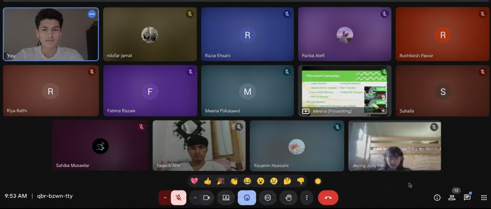
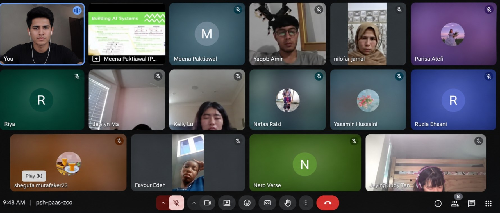
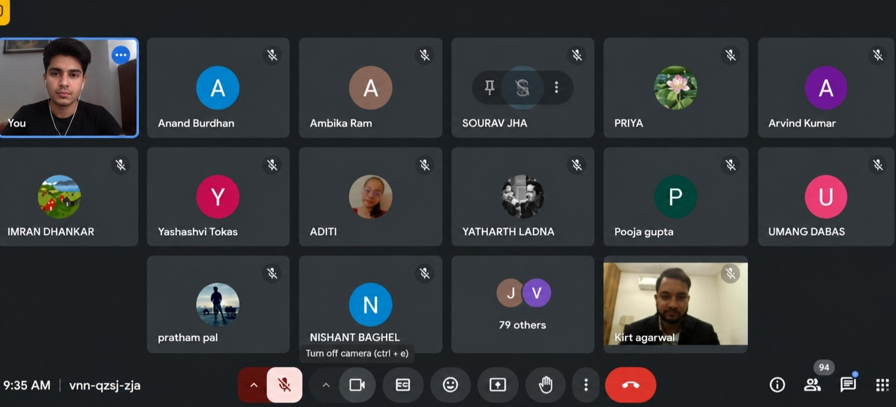
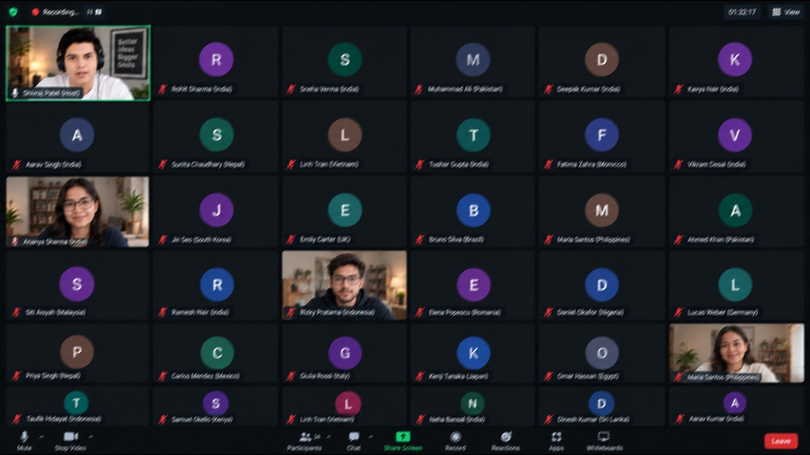
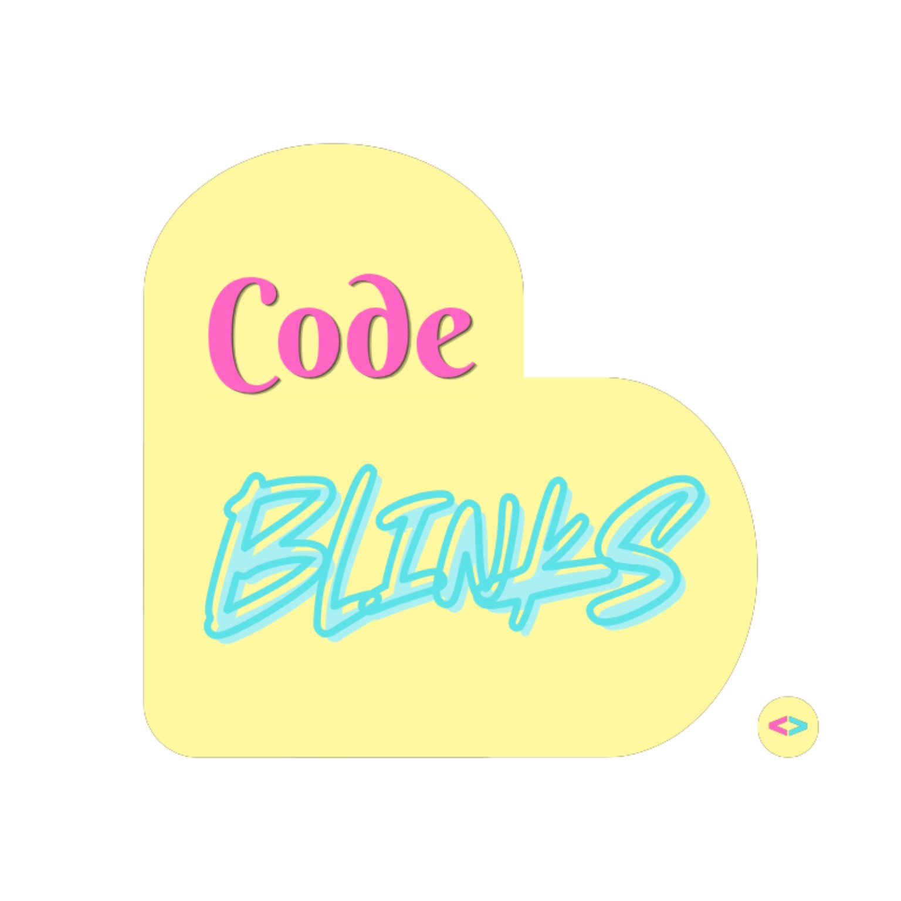
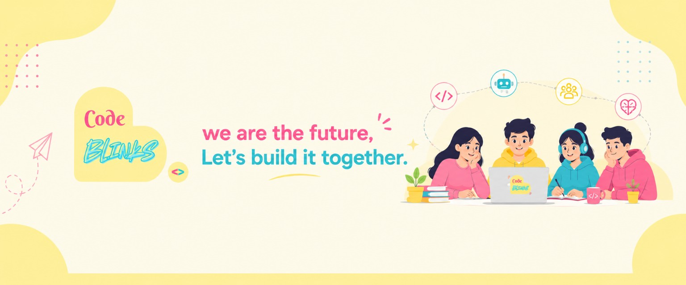

# 🌟 Code Blinks

> We Are the Future, Let's Build It Together.

Code Blinks is a global, student-led online community where students learn, connect, and grow through technology and shared experiences.

We introduce students to the fundamentals of coding, artificial intelligence, and the real-world applications of AI through interactive classes, workshops, and collaborative learning.

At the same time, Code Blinks focuses on an equally important part of student growth — mental well-being and awareness.

---

## 🌐 Live Demo

🔗 Website: [Live Demo](YOUR_LIVE_DEMO_URL_HERE)

> Replace YOUR_LIVE_DEMO_URL_HERE with your deployed website link.

---

## 🎯 Vision

Our vision is to:

> Empower a generation of confident, capable, and mentally resilient young creators who use technology to learn, innovate, and build a better future together.

We believe that students should have access to technology education while also having an environment where their well-being is valued.

The future should not be built at the cost of a student's mental well-being.

Code Blinks aims to bring these two areas together:

Technology + Learning + Mental Well-being + Community

---

## 🚀 Mission

Our mission is:

> To equip young people with the knowledge to build their future while creating an environment that reminds them to take care of themselves along the way.

Code Blinks believes that the future isn't built only through technical skills.

It is built by:

- Curious minds
- Creative ideas
- Supportive communities
- Collaboration
- Self-awareness
- Healthy learning environments
- Young people who are given the space to grow

We want students to learn, experiment, create, connect, and grow — both technically and personally.

---

## 📖 Overview

Code Blinks is a student-led online community focused on making technology education more approachable and meaningful for students.

Our initial program is a 4-week online learning experience that combines:

- 💻 Coding fundamentals
- 🤖 Introduction to Artificial Intelligence
- 🧠 Mental health awareness
- 🌱 Personal growth
- 🤝 Community and collaboration
- 📱 Responsible use of technology

The program is designed to help students understand technology while also encouraging conversations about academic pressure, stress, healthy habits, self-awareness, and well-being.

---

# 📚 Our 4-Week Program

## Week 1 — Introduction to Coding

Students are introduced to the fundamentals of coding and programming.

Topics include:

- What Is Coding?
- How Programming Works
- Programming Languages
- Algorithms & Problem Solving
- Introduction to AI

---

## Week 2 — Coding Fundamentals

Students explore fundamental programming concepts and develop logical problem-solving skills.

Topics include:

- Variables & Data Types
- Conditions & Logic
- Loops
- Functions
- Debugging Basics

---

## Week 3 — Mental Well-Being & Awareness

This week focuses on understanding mental well-being and creating healthier approaches to everyday pressure.

Topics include:

- Understanding Mental Health
- Mental Health Awareness
- Managing Stress
- Building Healthy Habits
- Self-Awareness & Emotional Well-Being

---

## Week 4 — Technology, Mind & Future

The final week connects technology with personal well-being and future-focused thinking.

Topics include:

- Technology & Mental Well-Being
- Responsible Use of Technology
- AI & the Future
- Building a Positive Digital Life
- Final Project & Reflection

---

# 💡 Impact

Code Blinks focuses on creating impact in three major areas.

## 💻 1. Technology & Digital Learning

Students are encouraged to:

- Learn beginner-level coding
- Understand the fundamentals of programming
- Explore artificial intelligence
- Understand everyday applications of AI
- Learn through interactive activities
- Create and experiment instead of only consuming technology

---

## 🧠 2. Mental Well-being

Students are encouraged to:
- Understand mental health and well-being
- Become more aware of emotional challenges
- Talk about academic and personal pressures
- Recognize feelings of stress and overwhelm
- Develop healthier habits
- Build self-awareness
- Understand when and where appropriate support may be needed

Code Blinks believes that well-being is an important part of learning and personal growth.

---

## 🤝 3. Community & Growth

Code Blinks aims to create a welcoming environment where students can:

- Learn together
- Connect with other students
- Share ideas
- Collaborate
- Build confidence
- Develop creativity
- Grow personally
- Explore technology together

---

# 👨‍💻 About Code Blinks

Code Blinks is built around a simple idea:

> Students shouldn't have to choose between building their future and taking care of themselves.

Technology is changing the world rapidly.

Learning how to code and understand AI can help students participate in that future. However, technical education should also be accompanied by awareness, support, healthy learning habits, and a positive community.

Code Blinks brings these ideas together through student-led learning and community activities.

---

# 🌱 Our Approach

We focus on four principles:

### Learn

Make technology approachable and help students build strong foundations.

### Create

Encourage students to experiment, build projects, and turn ideas into reality.

### Connect

Create opportunities for students to learn and collaborate with one another.

### Grow

Support both technical development and personal well-being.

---

# 🖼️ Project Images

## Code Blinks Logo

---

## Website Banner

---

## Founder

---

# 🛠️ Technologies Used

This project is built using simple and accessible web technologies:

- HTML5
- CSS3
- Responsive Web Design
- Google Fonts
- Image Assets

The website does not require a complicated framework or backend to run.

---
